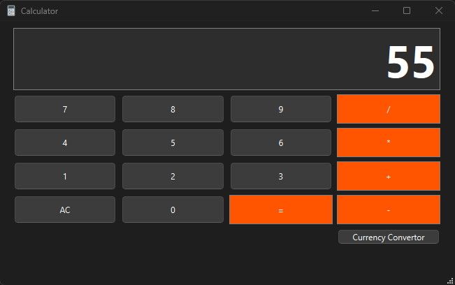
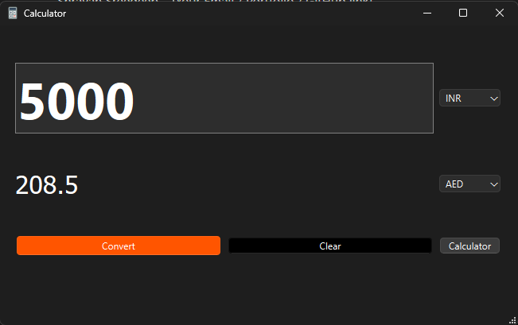

# Qt Calculator & Currency Converter

A simple **desktop application** built with **Qt 6** that combines a **basic calculator** and a **live currency converter**.

The app automatically adapts to the system theme (light/dark) and provides a modern, easy-to-use interface.

---

## 🛠 Features

### Calculator

* Basic arithmetic operations: `+`, `-`, `*`, `/`
* Clear, backspace, and decimal support
* Keyboard and button input

### Currency Converter

* Convert any amount between major currencies
* Fetches **real-time exchange rates** from the internet
* Supports decimal inputs
* Automatically adapts to system theme (light/dark)

### UI & Usability

* Theme-aware input fields
* Intuitive grid layout for calculator buttons
* Easy navigation between calculator and currency converter

---

## ⚙️ Installation / Running the App

1. **Clone or download** the project.
2. Open the project in **Qt Creator**.
3. Build the project in **Release mode**.
4. Deploy the app using `windeployqt` (Windows) to copy required Qt DLLs:

   ```bash
   windeployqt MyApp.exe
   ```
5. Run the executable.

> For macOS or Linux, build normally and ensure Qt runtime is installed.

---

## 🖼 Screenshots




---

## 🔗 Dependencies

* Qt 6 (Widgets)
* C++17 (or compatible compiler)
* Internet connection (for live currency rates)

---

## 📝 Notes / Tips

* **Numeric Input Only:** Currency fields accept only numbers, with optional decimals.
* **Resource Files:** Icons and images are bundled using Qt Resource System (`.qrc`).

---

## 📌 Optional Improvements / Future Features

* Add more advanced calculator functions (sin, cos, %, etc.)
* Store favorite currency pairs
* Format numbers with commas in the currency converter
* Add history of calculations and conversions

---

## 👤 Author

Shravan Sreedeep – [[shravansreedeep2000@gmail.com](https://mail.google.com/mail/u/0/?fs=1&to=shravansreedeep2000@gmail.com&su=Regarding_Calculator_App&tf=cm) / [LinkedIn](https://www.linkedin.com/in/shravansreedeep/)]
